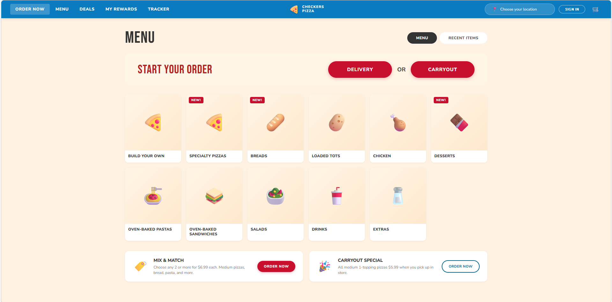

# Pizza Order Demo

A demo pizza ordering site built with vanilla HTML, CSS, and JavaScript. Features a 7-step ordering wizard with menu browsing, pizza customization, cart management, and checkout.



## 🚀 Live Demo

**[Try it now on GitHub Pages](https://victorhuangwq.github.io/pizza-order-demo/)**

## Local Development

Run the site locally with npm:

```bash
npm install
npm start
```

Then open **http://localhost:3000** in your browser.

## Project Structure

```
.
├── index.html             # Single-page wizard (all 7 steps)
├── css/
│   └── style.css          # Styling
├── js/
│   ├── app.js             # Wizard logic and state management
│   └── menu-data.js       # Unified product catalog & customization options
├── server.js              # Local dev server
└── package.json
```

## For Developers

### Deployment

This site is automatically deployed to GitHub Pages via GitHub Actions whenever changes are pushed to the `main` branch. No manual configuration needed.

To view deployment status:
- Go to [Actions tab](https://github.com/victorhuangwq/pizza-order-demo/actions)
- Check the "Deploy to GitHub Pages" workflow
